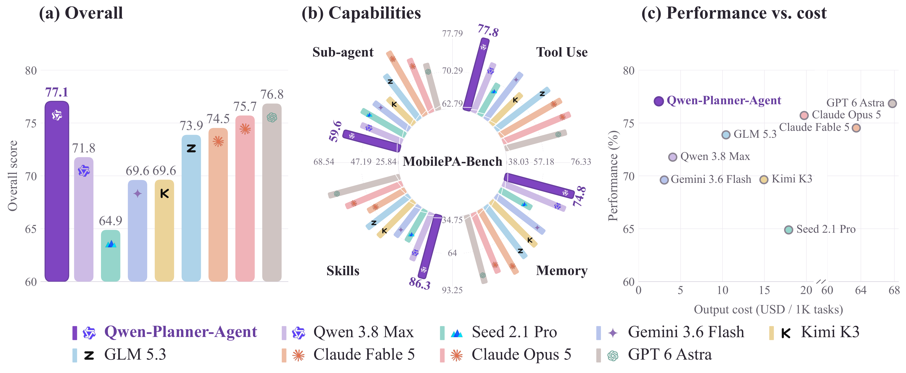
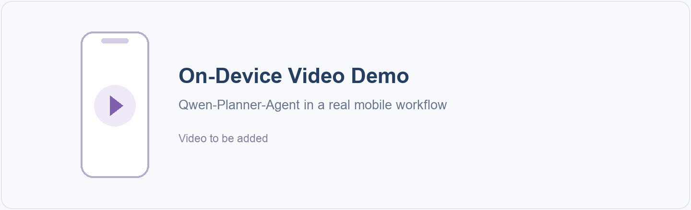
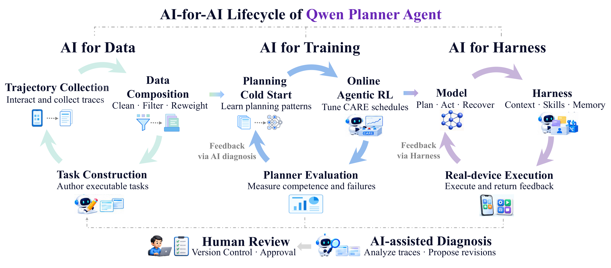

<div align="center">

<h1 align="center">&nbsp;Qwen-Planner-Agent</h1>

### A Closed-Loop AI-for-AI Framework for Real-World Mobile Planner Agents

**MAI Team, Alibaba Token Hub, Alibaba Group**

<p>
  <a href="https://tongyi-mai.github.io/Qwen-Planner-Agent/"></a>
  <a href="https://tongyi-mai.github.io/Qwen-Planner-Agent/Qwen-Planner-Agent-Technical-Report.pdf"></a>
  <a href="https://github.com/Tongyi-MAI/Qwen-Planner-Agent"></a>
  <!-- Add the arXiv and Hugging Face badges here when the public paper ID is available. -->
  <!-- <a href="#video-demo"></a> -->
</p>

</div>

<p align="center">
  <a href="https://tongyi-mai.github.io/Qwen-Planner-Agent/#performance">
  
  </a>
</p>

> [!IMPORTANT]
> **This is the blog and technical report website repository for Qwen-Planner-Agent**, containing research presentations and recorded examples. It is not the release repository for model weights, training code, or the agent implementation.
>
> **本仓库为 Qwen-Planner-Agent 博客与技术报告网站仓库**，用于展示研究成果与交互案例，不是模型权重、训练代码或智能体实现的发布仓库。

<a id="overview"></a>

## ✨ Highlights

**Qwen-Planner-Agent** combines a trained Planner Model with a stateful Harness to carry mobile tasks from user intent to verified execution. It coordinates native tools, persistent memory, reusable Skills, and specialized sub-agents. Our core contributions include:

- 🔄 **Closed-loop AI-for-AI development:** execution evidence connects task construction, trajectory curation, planner training, and Harness refinement, guiding successive improvements across the agent lifecycle.
- ⚡ **Competence-adaptive planner training:** planning-oriented supervised learning and hybrid-environment reinforcement learning develop the planner. **CARE** adapts rewards and advantages to model competence, balancing task completion with reasoning and tool-use efficiency.
- 🧠 **Contextual memory and state tracking:** the Harness retrieves task-relevant evidence and procedural guidance, helping the planner retain constraints across turns, reconcile prior dialogue with tool results, and revise only the requested settings.
- 🤝 **Coordinated execution and recovery:** the planner respects action prerequisites, transfers confirmed artifacts between sub-agents, and revises its approach when tools return errors.
- 🏆 **Strong performance at low output cost:** Qwen-Planner-Agent 27B achieves **77.05% Overall** on MobilePA-Bench, **9.83 percentage points** above its baseline, at an estimated **$2.41 per 1,000 tasks** in output-token cost.

<a id="performance"></a>

## 📊 Performance

Qwen-Planner-Agent 27B ranks first in Overall among the evaluated systems. The comparison below covers tool use, memory, Skills, sub-agent coordination, and estimated output cost including thinking tokens.

| Model / System | Overall | Tool Use | Memory | Skills | Sub-agent |
| --- | ---: | ---: | ---: | ---: | ---: |
| **Qwen-Planner-Agent 27B** | **77.05** | **77.79** | 74.76 | 86.25 | 59.55 |
| GPT 6 Astra | 76.84 | 75.71 | 74.73 | **93.25** | 53.93 |
| Claude Opus 5 | 75.71 | 77.60 | 71.81 | 83.00 | 59.55 |
| Claude Fable 5 | 74.53 | 77.21 | **76.33** | 69.00 | **68.54** |
| GLM 5.3 | 73.88 | 76.44 | 72.07 | 77.00 | 58.43 |
| Qwen 3.8 Max | 71.77 | 73.65 | 73.14 | 75.75 | 51.69 |
| Kimi K3 | 69.64 | 71.54 | 71.01 | 74.75 | 47.19 |
| Gemini 3.6 Flash | 69.61 | 74.71 | 69.68 | 65.75 | 51.69 |
| Seed 2.1 Pro | 64.89 | 70.29 | 57.18 | 64.00 | 55.06 |

Scores are percentages; higher is better. Selected systems are ordered by Overall, with the highest score in each column in bold. Cost estimates cover output tokens, excluding input tokens, external tool charges, device execution, and additional Harness processing.

<!-- Video demo reserved for a future release.

<a id="video-demo"></a>

## 🎥 Video Demo

<p align="center">
  
</p>

Replace the poster with the recorded on-device video or a linked thumbnail before restoring this section.

-->

<a id="interactive-examples"></a>

## 📱 Interactive Examples

**[Watch the interactive examples on our project website →](https://tongyi-mai.github.io/Qwen-Planner-Agent/#demos)**

Choose a capability below to open its recorded replay on the project website. Each example shows the user request, model reasoning, tool calls, environment feedback, and confirmed state changes.

| Capability | Example |
| --- | --- |
| [**Memory-Guided Planning ↗**](https://tongyi-mai.github.io/Qwen-Planner-Agent/#demo-coding) | Recovering a complete development procedure from partial memory, then opening the editor, connecting shared input, and enabling USB debugging in order. |
| [**Multi-Turn State Tracking ↗**](https://tongyi-mai.github.io/Qwen-Planner-Agent/#demo-dialogue) | Resolving a conflict between dialogue acknowledgements and tool evidence before stopping an active cast and reconnecting to the requested device. |
| [**Sub-Agent Coordination ↗**](https://tongyi-mai.github.io/Qwen-Planner-Agent/#demo-handoff) | Waiting for confirmed downloads before handing exact filenames and folder assignments to the next application. |
| [**Personalized State Correction ↗**](https://tongyi-mai.github.io/Qwen-Planner-Agent/#demo-accessibility) | Combining a saved reading routine with current accessibility settings to make a scoped correction. |
| [**Skill-Guided Execution ↗**](https://tongyi-mai.github.io/Qwen-Planner-Agent/#demo-skills) | Applying procedural guidance to confirm that a note is saved before shutting down the phone. |
| [**Error Recovery ↗**](https://tongyi-mai.github.io/Qwen-Planner-Agent/#demo-recovery) | Responding to conversion failures with a calculator-based alternative and completing the requested message. |

The replays preserve complete tool arguments and returns, including failed attempts and subsequent corrections. Phone screens illustrate states confirmed by the recorded tool results.

<a id="methodology"></a>

## 🧩 Methodology

Our framework uses AI to help develop more capable agents across three connected stages:

- **AI for Data:** an agentic data flywheel constructs executable tasks, collects interaction trajectories, and uses verification and failure analysis to guide data curation.
- **AI for Training:** planning-oriented supervised learning and hybrid-environment reinforcement learning develop the planner. Competence-Aware Reward-and-Advantage Engineering (**CARE**) balances task completion with reasoning and tool-use efficiency.
- **AI for Harness:** tool-conditioned Skills and evidence-grounded memory assemble task-relevant context, while execution feedback supports iterative model–Harness refinement.

<p align="center">
  <a href="https://tongyi-mai.github.io/Qwen-Planner-Agent/#approach">
  
  </a>
</p>

**[Explore the full technical report website →](https://tongyi-mai.github.io/Qwen-Planner-Agent/)**

<a id="citation"></a>

## 📝 Citation

```bibtex
@techreport{mai2026qwenplanneragent,
  title = {Qwen-Planner-Agent: A Closed-Loop AI-for-AI Framework for Real-World Mobile Planner Agents},
  author = {{MAI Team}},
  institution = {Alibaba Token Hub, Alibaba Group},
  year = {2026},
  month = sep,
  url = {https://github.com/Tongyi-MAI/Qwen-Planner-Agent}
}
```
